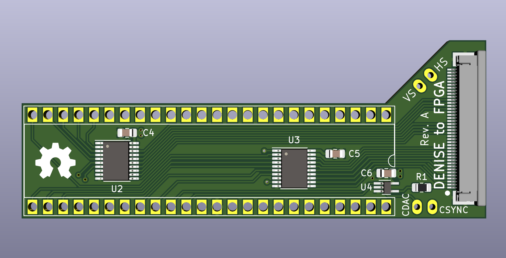

# Denise_to_FPGA
A small adapter-board that connects 12-bit RGB, 14 MHz CLK, PIXELSW and SYNC-signals on Denise to a FPGA-board via a 5V-tolerant buffer.
A synchronous 14 MHz clock is generated from `C7M XOR CDAC` by using a `74LVC1G86`-chip. This will be fed into the FPGA's PLL.

Board is two layers.

WORK IN PROGRESS, NOT TESTED YET!

***

***

[![CC BY-SA 4.0][cc-by-sa-shield]][cc-by-sa]

This work is licensed under a
[Creative Commons Attribution-ShareAlike 4.0 International License][cc-by-sa].

[![CC BY-SA 4.0][cc-by-sa-image]][cc-by-sa]

[cc-by-sa]: http://creativecommons.org/licenses/by-sa/4.0/
[cc-by-sa-image]: https://licensebuttons.net/l/by-sa/4.0/88x31.png
[cc-by-sa-shield]: https://img.shields.io/badge/License-CC%20BY--SA%204.0-lightgrey.svg
