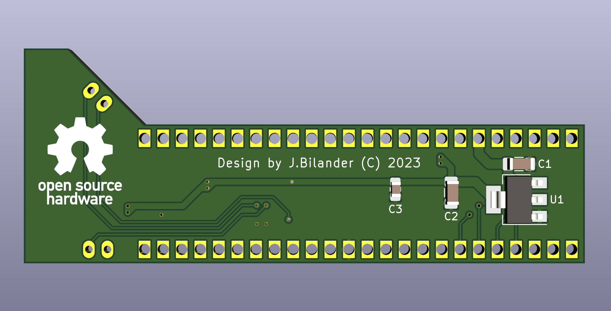

# Denise_to_FPGA
A small adapter-board that connects 12-bit RGB, 14 MHz CLK, PIXELSW and SYNC-signals on Denise to a FPGA-board via a 5V-tolerant buffer.
A synchronous 14 MHz clock is generated from `C7M XOR CDAC` by using a `74LVC1G86`-chip. This will be fed into the FPGA's PLL.

Board is two layers.

WORK IN PROGRESS, NOT TESTED YET!

***

***

BOM Rev. A
---------
Designator  | Name/Value   | Package | Notes
-|-|-|-|
U1 | Voltage Regulator 3.3V,   LM1117-3.3 or   AMS1117-3.3 | SOT-223 | 3.3V 1A Low Drop-Out (LDO) [Voltage regulator](https://www.aliexpress.com/item/32869037691.html).
U2,U3 | Bus Transceiver 74LVC245A  | TSSOP-20 | [74LVC245APW-T](https://www.mouser.com/ProductDetail/771-74LVC245APW-T)
U4 | XOR Gate 74LVC1G86 | SOT-353 | [74LVC1G86](https://www.mouser.com/ProductDetail/621-74LVC1G86QSE-7)
U5 | 48 pcs TH socket pins | 100 Pcs | IC Leads Receptacle, Length 9.7 mm gold or nickel plated. [100 pcs](https://www.aliexpress.com/item/1005002830101899.html) [300 pcs](https://www.aliexpress.com/item/1005004707554342.html) [1000 pcs](https://www.aliexpress.com/item/32972142300.html) [1000 pcs](https://www.aliexpress.com/item/32791545218.html)
C1,C2 | Capacitor 10uF | 1206 | Caps for Voltage Regulator
C3-C6 | Capacitor 0.1uF = 100nF | 0805 | Decoupling caps
R1 | 22 or 33 Ω Resistor | 0805 | 22 or 33 Ω series resistor to [avoid reflections](https://embeddeddesignblog.blogspot.com/2022/07/why-do-we-need-series-resistor-on-clock.html) on the 14 MHz CLK
J1 | CDAC/CSYNC Two-Pin Header 2.54mm pitch | 2.54mm pitch | Connect a fly-lead here for old Rev. 3 A500 Motherboard that doesn't have these signals at the Denise socket. 
J2 | VSYNC/HSYNC Two-Pin Header 2.54mm pitch | 2.54mm pitch | Connect a fly-lead here with connection to the Horizontal and Vertical sync on DB23-backside. 
J3 | FPC connector, Right Angle, bottom contact | 0.5mm pitch, 40 positions | [TE Connectivity 4-1734592-0](https://www.mouser.com/ProductDetail/571-4-1734592-0) or [40p here](https://www.aliexpress.com/item/10000000478377.html)

***

[![CC BY-SA 4.0][cc-by-sa-shield]][cc-by-sa]

This work is licensed under a
[Creative Commons Attribution-ShareAlike 4.0 International License][cc-by-sa].

[![CC BY-SA 4.0][cc-by-sa-image]][cc-by-sa]

[cc-by-sa]: http://creativecommons.org/licenses/by-sa/4.0/
[cc-by-sa-image]: https://licensebuttons.net/l/by-sa/4.0/88x31.png
[cc-by-sa-shield]: https://img.shields.io/badge/License-CC%20BY--SA%204.0-lightgrey.svg
